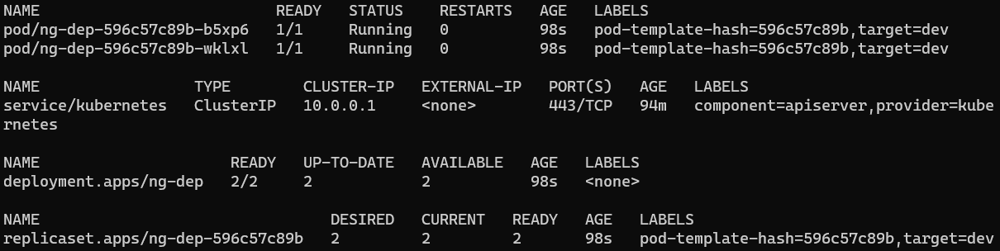
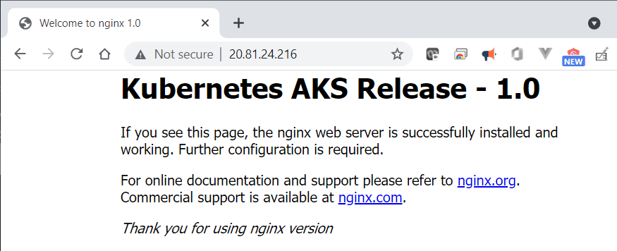
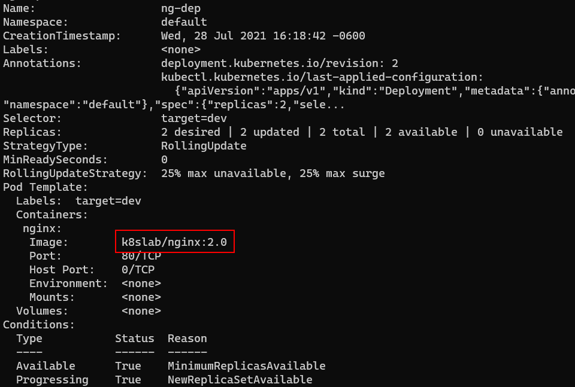

# Lab : Core Kubernetes Concepts


> Estimated Duration: 60 minutes

## Module 1 Table of Contents

[Exercise 1: Create a Basic Azure Kubernetes Service (AKS) Cluster](#exercise-1-create-a-basic-azure-kubernetes-service-aks-cluster)

[Exercise 2: Creating a Pod Declaratively](#exercise-2-creating-a-pod-declaratively)

[Exercise 3: Labels on a Pod](#exercise-3-labels-on-a-pod)

[Exercise 4: Working with Deployments](#exercise-4-working-with-deployments)

[Exercise 5: Working with Services](#exercise-5-working-with-services)

[Exercise 6: Jobs and CronJobs](#exercise-6-working-with-jobs-and-cronjobs)

[Exercise 7: Helm](#exercise-7-working-with-helm)

[Exercise 8: Cleanup](#exercise-cleanup)

# Exercise 1: Create a Basic Azure Kubernetes Service (AKS) Cluster

In this exercise you will create a simple AKS cluster. In the next module, you'll create a more complete one.

### Task 1 - Login into your subscription and register providers

1. Log in to your Azure subscription at https://portal.azure.com.
1. At the top of the portal window, click on the Cloud Shell icon.


1. Make sure that the Cloud Shell window is open in the Bash mode.

   

1. At this point, you are logged in to Azure automatically via Cloud Shell, but you need to make sure Cloud Shell is pointed to the correct subscription if you have multiple Azure subscriptions. Set the current subscription. Your subscription name may be different.

1. Set the Subscription 
    ```bash
    az account set --subscription "Get ID from Instructor"
    ```

### Task 2 - Setup Environment

1. Download files from GitHub
    ```bash
    git clone https://github.com/RandyPatterson/aksworkshop_student.git
    cd aksworkshop_student/
    ```
1. Update environment variables in **.env** file 
    ```bash
    code .env
    ```
1. Replace the string "rrp" with your initials (all lower case)
    

1. When finished, press **CTRL-Q** to quit and click the **SAVE** button
    

1. Create the environment variables
    ```bash
    source .env
    ```

### Task 3 - Create a basic cluster using Azure CLI

1. Create Resource Group.

    ```bash
    az group create \
        --location $LOCATION \
        --resource-group $AKS_RESOURCE_GROUP \
        --tag eai=3539482 shared_resource=false prod=false
    ```

1. Create a simple AKS cluster.

    ```bash
    az aks create \
        --node-count 2 \
        --generate-ssh-keys \
        --name $AKS_NAME  \
        --resource-group $AKS_RESOURCE_GROUP \
        --tag eai=3539482 shared_resource=false prod=false
    ```

    > This process will take 5-10 minutes to complete

1. Once complete, connect the cluster to your cloud shell

    ```bash
    az aks get-credentials \
        --name $AKS_NAME \
        --resource-group $AKS_RESOURCE_GROUP
    ```

1. Confirm the connection to the cluster.

    ```bash
    kubectl get nodes
    ```

This should return a list of nodes similar to the one below:


#### Congratulations! you have successfully created and connect to an Azure Kubernetes Cluster (AKS)

# Exercise 2: Creating a Pod Declaratively

This Exercise demonstrates the use of a YAML file to create a pod declaratively.

### Task 1 - Create a Pod declaratively


1. Use the YAML file provided to create a Pod. You may want to open the **simple-pod.yaml** file and review its contents.

    The pod definition contains the **Nginx** container that listens to port 80.

    ```bash
    kubectl apply -f simple-pod.yaml
    ```

1. Now, make sure pod is up and running.

    ```bash
    kubectl get pods
    ```

    You should see a pod named **nginx-pod**

    

1. Add a second pod, then check the list again.

    ```bash
    kubectl apply -f simple-pod2.yaml
    kubectl get pods
    ```

### Task 2 - Filter pods based on a label

1. Show all the labels in the pods

    ```bash
    kubectl get pods --show-labels
    ```

    

1. Let's say you want to list pods that have a label named **kind=web** associated with them. You can use **-l** switch to apply filter based on labels.

    ```bash
    kubectl get pod -l kind=web
    ```

1. To prove that this works as expected, run the command again but change the value of label **kind** to **db**. Notice, this time _kubectl_ doesn't return any pods because there are no pods that match the label **kind** and a value of **db**.

    ```bash
    kubectl get pod -l kind=db
    ```

### Task 3 - View complete definition of the Pod

1. Query Kubernetes to return the complete definition of a Pod from its internal database by exporting the output (**-o**) to **YAML**. Then pipe the result to a file.

    ```bash
    kubectl get pods nginx-pod -o yaml > mypod.yaml
    ```

    > To view the JSON version, use the **-o json** flag instead.

1.  View the contents of the generated file 

    ```bash
    cat mypod.yaml
    ```

    

**NOTE:** Observe all the properties that Kubernetes populated with default values when it saved the Pod definition to its database.


# Exercise 3: Labels on a Pod

In this Exercise, you will create a pod that has labels associated with it. Labels make it easy to filter the pods later. Labels play a vital role in the Kubernetes ecosystem, so it's important to understand their proper usage.

### Task 1 - Assign a new label to a running Pod

1. Assign a new label (key=value) pair to a running pod. This comes in handy when you are troubleshooting an issue and would like to distinguish between different pod(s). Assign a new label **health=fair** to the pod **nginx-pod**, which is already running.

    ```bash
    kubectl label pod nginx-pod health=fair
    ```

1. Run the command below to show the pod labels. Notice that now an additional label is shown with the pod.

    ```bash
    kubectl get pods nginx-pod --show-labels
    ```

### Task 2 - Update an existing label that is assigned to a running pod

1. Update the value of an existing label that is assigned to a running pod. Change the value of the label **kind=web** to **kind=db** of the **nginx-pod** pod.

    ```bash
    kubectl label pod nginx-pod kind=db --overwrite
    ```

**--overwrite** is needed because the pod is running and won't accept changes otherwise.

1. Show the pod labels again. Notice that _kind_ has changed from **web** to **db**.

    ```bash
    kubectl get pods --show-labels
    ```

### Task 3 - Delete a label that is assigned to a running Pod

1. Delete the label **health** from the **nginx-pod** pod.

    ```bash
    kubectl label pod nginx-pod health-
    ```

    **NOTE:** Notice the minus (**-**) sign at the end of the command. You can also remove a label from all running pods by using the **--all** flag.

    ```bash
    kubectl label pod health- --all
    ```
    


1. Run the command below to show the pod labels again. Notice that _health_ is not part of the list of labels.

    ```bash
    kubectl get pods --show-labels
    ```

### Task 4 - Delete Pods based on their labels

1. Delete all the Pods that match a specific label.

    ```bash
    kubectl delete pod -l target=dev
    ```

# Exercise 4: Working with Deployments

In this Exercise, you will create a Deployment and rollout an application update. Deployments provide a consistent mechanism to upgrade an application to a new version, while keeping the downtime to a minimum. Note that internally, Deployments use _ReplicaSets_ for managing Pods. However, you never work directly with _ReplicaSets_ since Deployments abstract out that interaction.

### Task 1 - Create a new Deployment

The **ng-dep.yaml** file contains a Deployment manifest. The Pod in the _template_ contains an _nginx_ container with a tag **1.0**. The **1.0** represents the version of this container and hence of the application running inside it.

1. Create a Deployment and a Service to access the Pods of the deployment.

    ```bash
    kubectl apply -f ng-dep.yaml
    kubectl apply -f ng-svc.yaml
    ```


1. Run the following command to see the Pods, ReplicaSets, Deployments and Services that were created.

    ```bash
    kubectl get all --show-labels
    ```

    

### Task 2 - Access version 1.0 of application

1. Wait about 3-4 minutes to allow Azure to create a Public IP address for the service. Check to see if an address has been assigned by getting the list of services.

    ```bash
    kubectl get svc
    ```

    

2. When you see an **EXTERNAL-IP** assigned, open a browser with that address. Example: **http://20.81.24.216**

    

### Task 3 - Update the Deployment to version 2.0

You are now going to update the Deployment to use version **2.0** of the container instead of **1.0**. This can be done in one of two ways. One approach is to use _imperative_ syntax, which is faster and is often used during the development/testing stage of an application. The alternate method is to update the YAML file and then to reapply it to the cluster.

1. To start rolling out the new update, change the container image tag from **1.0** to **2.0** by running this command:

    ```bash
    kubectl set image deployment ng-dep nginx=k8slab/nginx:2.0
    ```

1. In the command above, **ng-dep** is the name of Deployment and **nginx** is the name of the container within the Pod template. The change will force the Deployment to create a new ReplicaSet with an image tagged **2.0**.

1. List all the pods and notice that old pods are terminating and that new Pods have been created.

    ```bash
    kubectl get pods
    ```

1. Run the following command to review the Deployment definition with the updated value of container image:

    ```bash
    kubectl describe deployment ng-dep
    ```

    

    > Notice the Image section (under Containers) shows the value of container image as **2.0**.

1. Run the command to view the Pods, ReplicaSets and Deployments again.

    ```bash
    kubectl get all
    ```

    

    > Notice that the old replica set still exists, even though it has 0 Desired Pods.

1. Run the _describe_ command on that old ReplicaSet.

    ```bash
    kubectl describe rs <old replicaset name>
    ```

    

    > Notice that the old definition still has the previous version number. This is maintained so you can roll back the change to that version if you which.

1. Access the 2.0 version of application by refreshing the browser at the same address as above.

    

### Task 4 - Rollback the Deployment

The purpose of maintaining the previous **ReplicaSet** is to be able to rollback changes to any previous version.

1. Review the deployment history.

    ```bash
    kubectl rollout history deploy/ng-dep
    ```

1. Rollback the Deployment to the previous version.

    ```bash
    kubectl rollout undo deploy/ng-dep
    ```

1. Wait a few seconds and refresh the browser again.

    

    > Notice the site is back to the previous version.

### Task 5 - Delete the Deployment and Service

1. Delete the Deployment and Service.

    ```bash
    kubectl delete deployment ng-dep
    kubectl delete service ng-svc
    ```

    **NOTE:** It may take a few minutes to delete the service because has to delete the Public IP resource in Azure.


# Exercise 5: Working with Services

In this Exercise you will create a simple Service. Services help you expose Pods externally using label selectors.

### Task 1 - Create a new Service

1. Create a deployment.

    ```bash
    kubectl apply -f sample-dep.yaml
    ```

1. The **sample-svc.yaml** file contains a Service manifest. Services use label selectors to determine which Pods it needs to track and forward the traffic to.

1. Review running Pods and their labels.

    ```bash
    kubectl get pods --show-labels
    ```

    > Notice the label **sample=color** that is associated with the Pods.

1. Open the **sample-svc.yaml** file and examine the **selector** attribute. Notice the **sample: color** selector. This Service will track all Pods that have a label **sample=color** and load balance traffic between them.

1. Create the Service.

    ```bash
    kubectl apply -f sample-svc.yaml
    ```

1. Check the of newly created service.

    ```bash
    kubectl get svc -o wide
    ```

The command above will display the details of all available services along with their label selectors. You should see the **sample-svc** Service with **PORTS 80:30101/TCP** and **SELECTOR sample=color**.

### Task 2 - Access the sample-svc Service

1. Open a browser and navigate to the IP address shown in the output of the previous command.

    

1. The website displays the Node IP/Pod IP address of the pod currently receiving the traffic through the service's load balancer. The page refreshes every 3 seconds and each request may be directed to a different pod, with a different IP address. This is the service's internal load balancer at work.

### Task 3 - Delete the Deployment and Service

Deleting any Pod will simply tell Kubernetes that the Deployment is not in its _desired_ state and it will create a replacement. You can only delete Pods by deleting the Deployment.

1. Delete the Deployment.

    ```bash
    kubectl delete deployment sample-dep
    ```

1. The Service is independent of the Pods it services, so it's not affected when the Deployment is deleted. Anyone trying to access the service's address will simply get a 404 error. If the Deployment is ever re-created, the Service will automatically start sending traffic to the new Pods.

1. Delete the Service.

    ```bash
    kubectl delete service sample-svc
    ```

# Exercise 6: Working with Jobs and CronJobs
In this exercise, you will create a Job and a CronJob. Jobs are used to run a task to completion, while CronJobs are used to run a task at a specific time or at regular intervals.

### Task 1 - Working with Kubernetes Jobs
A Job creates one or more Pods and will continue to retry execution of the Pods until a specified number of them successfully terminate. As pods successfully complete, the Job tracks the successful completions. When a specified number of successful completions is reached, the task (i.e., Job) is complete. Deleting a Job will clean up the Pods it created. Suspending a Job will delete its active Pods until the Job is resumed again.

A simple case is to create one Job object in order to reliably run one Pod to completion. The Job object will start a new Pod if the first Pod fails or is deleted (for example due to a node hardware failure or a node reboot).

You can also use a Job to run multiple Pods in parallel.

1. View the contents of the **sample-job.yaml** file.

    ```bash
    cat sample-job.yaml
    ```
    ```yaml
    apiVersion: batch/v1
    kind: Job
    metadata:
    name: countdown-job
    spec:
    # Settings Apply to the whole job
    completions: 10 # create a total of 10 pods
    parallelism: 4 # run multiple pods simultanously
    backoffLimit: 3 # hard stop after 3 failure
    activeDeadlineSeconds: 100 # total time the whole job has to complete
    ttlSecondsAfterFinished: 240
    template:
        metadata:
        name: countdown-job
        labels:
            app: countdown-job
            color: aqua
        spec:
        containers:
        - name: counter
            image: centos:7
            command:
            - "bin/bash"
            - "-c"
            - "for i in 9 8 7 6 5 4 3 2 1 ; do echo $i; sleep 2 ; done"
        restartPolicy: OnFailure
        nodeSelector:
            kubernetes.io/os: linux
    ```

    > Notice the **completions** attribute is set to **10** while the **parallelism** is set to 4. This means that the Job will have 4 Pods running at a time until 10 of them complete successfully  (Status=Completed).

1. Create a Job that runs a simple command to print the current date and time.

    ```bash
    kubectl apply -f sample-job.yaml
    ```

1. List the pods that are running. Repeat the command until all 10 pods are in the **Completed** state.

    ```bash
    kubectl get pods
    ```
    The output will look similar to the one below:

    ```
    NAME                  READY   STATUS      RESTARTS   AGE
    countdown-job-62g7p   0/1     Completed   0          3m10s
    countdown-job-7s5sb   0/1     Completed   0          3m40s
    countdown-job-ftsw8   0/1     Completed   0          3m11s
    countdown-job-fz255   0/1     Completed   0          3m40s
    countdown-job-hsbbk   0/1     Completed   0          3m10s
    countdown-job-lcgd6   0/1     Completed   0          3m40s
    countdown-job-nb8sq   0/1     Completed   0          3m10s
    countdown-job-pj9hd   0/1     Completed   0          2m49s
    countdown-job-slbh5   0/1     Completed   0          3m40s
    countdown-job-wmdb4   0/1     Completed   0          2m48s
    ```
1. Clean up the Job.

    ```bash
    kubectl delete job countdown-job
    ```

    **NOTE:** This will delete all the Pods that were created by the Job.


### Task 2 - Working with Kubernetes CronJobs
Kubernetes *CronJobs* are a type of Kubernetes resource that allows you to schedule and automate the execution of tasks or jobs at specified intervals. They are useful for running recurring jobs, such as backups, data synchronization, or periodic maintenance tasks.

When a *CronJob* is created, Kubernetes automatically creates a Job object based on the job template and schedules it according to the specified schedule. Each scheduled run of the job creates a new instance of the Job, which runs to completion before terminating.

1. View the contents of the **sample-cronjob.yaml** 
    ```bash
    cat sample-cronjob.yaml
    ```

    ```yaml
    apiVersion: batch/v1
    kind: CronJob
    metadata:
    name: sample-cron-job
    spec:
    # https://kubernetes.io/docs/concepts/workloads/controllers/cron-jobs/#writing-a-cronjob-spec
    #            ┌───────────── minute (0 - 59)
    #            │ ┌───────────── hour (0 - 23)
    #            │ │ ┌───────────── day of the month (1 - 31)
    #            │ │ │ ┌───────────── month (1 - 12)
    #            │ │ │ │ ┌───────────── day of the week (0 - 6) (Sunday to Saturday)
    #            │ │ │ │ │                                   OR sun, mon, tue, wed, thu, fri, sat
    #            │ │ │ │ │
    #            │ │ │ │ │
    #            * * * * *
    schedule: "* * * * *"
    successfulJobsHistoryLimit: 6
    failedJobsHistoryLimit: 6
    jobTemplate:
        spec:
        completions: 1
        ttlSecondsAfterFinished: 270
        template:
            metadata:
            labels:
                color: yellow
            spec:
            containers:
                - name: hello
                image: busybox
                args:
                    - /bin/sh
                    - -c
                    - date; echo Hello from the Kubernetes cluster
                    - sleep 3
            restartPolicy: OnFailure
            nodeSelector:
                kubernetes.io/os: linux
    ```
>The CronJob **schedule** tells Kubernetes to run the job every minute. The **completions** attribute is set to **1**. This means that the Job will run once every minute. The **successfulJobsHistoryLimit** and **failedJobsHistoryLimit** attributes are set to **6**. This means that Kubernetes will keep the history of the last 6 successful and failed jobs.

1. Create a CronJob that runs a simple command to print a message then exit.

    ```bash
    kubectl apply -f sample-cron-job.yaml
    ```

1. List the CronJobs that are running.

    ```bash
    kubectl get cronjobs
    ```
    The output will show the current status and schedule for the CronJob.

    ```
    NAME              SCHEDULE    SUSPEND   ACTIVE   LAST SCHEDULE   AGE
    sample-cron-job   * * * * *   False     0        <none>          20s
    ```

1. List the pods that Pods that have completed successfully and the ones that have failed (in any).

    ```bash
    kubectl get pods
    ```

    The output will show the Pods that have completed successfully and the ones that have failed.

    ```
    NAME                            READY   STATUS      RESTARTS   AGE
    sample-cron-job-1631013200-5z5z 0/1     Completed   0          2m
    sample-cron-job-1631013260-5z5z 0/1     Completed   0          1m
    sample-cron-job-1631013320-5z5z 0/1     Completed   0          1m
    sample-cron-job-1631013380-5z5z 0/1     Completed   0          1m
    sample-cron-job-1631013440-5z5z 0/1     Completed   0          1m
    sample-cron-job-1631013500-5z5z 0/1     Completed   0          1m
    ```

1. Clean up the CronJob.

    ```bash
    kubectl delete cronjob sample-cron-job
    ```
    **NOTE:** This will delete all the Pods that were created by the CronJob.

# Exercise 7: Working with Helm
In this exercise, you will use Helm to install and manage a simple application.

### Task 1 - Use helm to install an application

1. 
    ```bash
        .
        ├── Chart.yaml    \\ A YAML file containing information about the chart
        ├── LICENSE       \\ A plain text file containing the license for the chart
        ├── README.md     \\ A README providing information about the chart usage, configuration, installation etc.
        ├── templates     \\ A directory of templates that will generate valid Kubernetes manifest files when combined with values.yaml
        │   ├── _helpers.tpl               \\ Template helpers/definitions that are re-used throughout the chart
        │   ├── guestbook-deployment.yaml  \\ Guestbook app container resource
        │   ├── guestbook-service.yaml     \\ Guestbook app service resource
        │   ├── NOTES.txt                  \\ A plain text file containing short usage notes about how to access the app post install
        │   ├── redis-master-deployment.yaml  \\ Redis master container resource
        │   ├── redis-master-service.yaml     \\ Redis master service resource
        │   ├── redis-slave-deployment.yaml   \\ Redis slave container resource
        │   └── redis-slave-service.yaml      \\ Redis slave service resource
        └── values.yaml   \\ The default configuration values for the chart
    ```
    
1. Create a Namespace to host the guestbook application

    ```bash
    kubectl create namespace guestbook
    ```
1. From the **aksworkshop_student** directory, Install the application using Helm.

    ```bash
    helm install guestbook ./guestbook --namespace guestbook
    ```

1. List the resources created by the Helm Chart
    
    ```bash
    kubectl get all --namespace guestbook
    ```

    The output will look similar to the one below:
    
        

>Note: The **guestbook** application is a simple multi-tier web application that allows users to post messages and read messages from other users. The application consists of a web front end, a Redis master for storage, and a replicated set of Redis slaves. 

1. Locate the guestbook service and using your favorite browser, navigate to the **EXTERNAL-IP** address Port 3000 __(http://EXTERNAL-IP:3000)__ to access the guestbook application. You may need to wait a few minutes for the **EXTERNAL-IP** to be assigned.
>NOTE: Your IP address will be different from the one shown in the image below.
    

1. Review Helm installation 
    
    ```bash
    helm list --namespace guestbook
    ```
    the output will look similar to the one below:
    
>NOTE: There is currently one release of the guestbook application installed in the **guestbook** namespace as indicated by the single **REVISION**
1. Deploy version 2 of the application

    ```bash
    code guestbook/Chart.yaml
    ```
    Update **apiVersion to v2** and **version to 2.2.2**
    
    Press **CTRL-Q** to quit then click the **SAVE** button

    Next, update the application image to Version 2. Change the tag for the repository *ibmcom/guestbook* from v1 to **v2**
    ```bash
    code guestbook/values.yaml
    ```
    
    Press **CTRL-Q** to quit then click the **SAVE** button

    Now lets deploy the updated application with the new image
    ```bash
    helm upgrade guestbook ./guestbook --namespace guestbook
    ```
    

1. Review Helm installation 
    
     ```bash
    helm list --namespace guestbook
    ```
    the output will look similar to the one below:
    
    

# Exercise 8: Cleanup

### Task 1 - Delete the cluster
When you're done with the lab, you can delete the cluster to avoid incurring any charges.

1. re-create the environment variables

    ```bash
    source .env
    ```

1. Deleting the cluster you created in [Exercise 1](#exercise-1-create-a-basic-azure-kubernetes-service-aks-cluster).

    ```bash
    az aks delete --name $AKS_NAME  --resource-group $AKS_RESOURCE_GROUP
    ```

**NOTE:** This will take several minutes to complete
